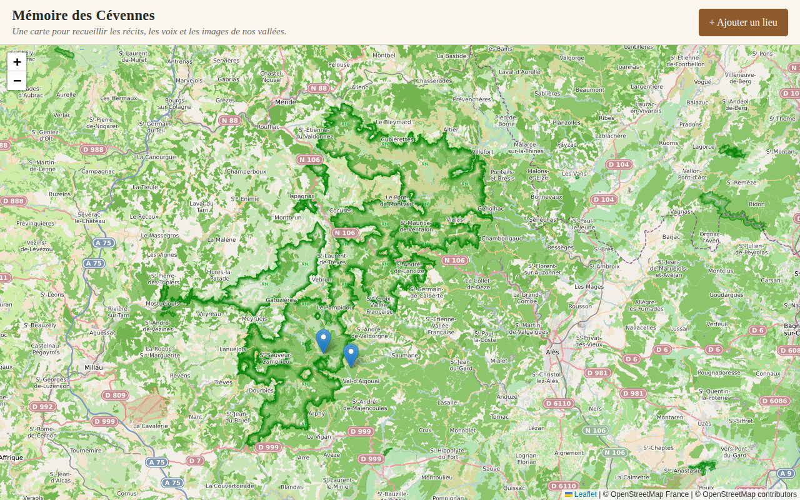
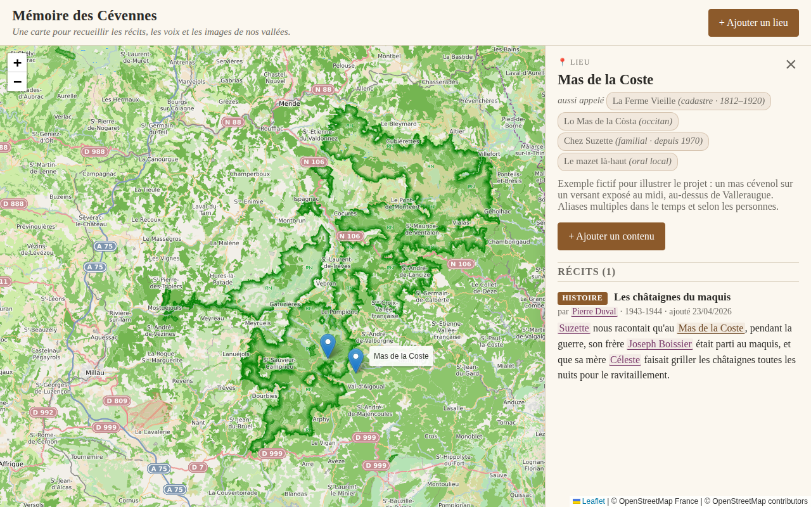
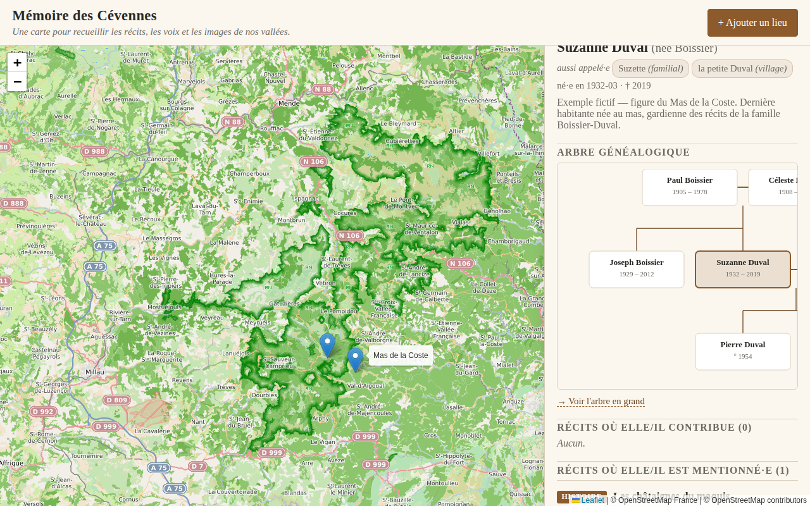
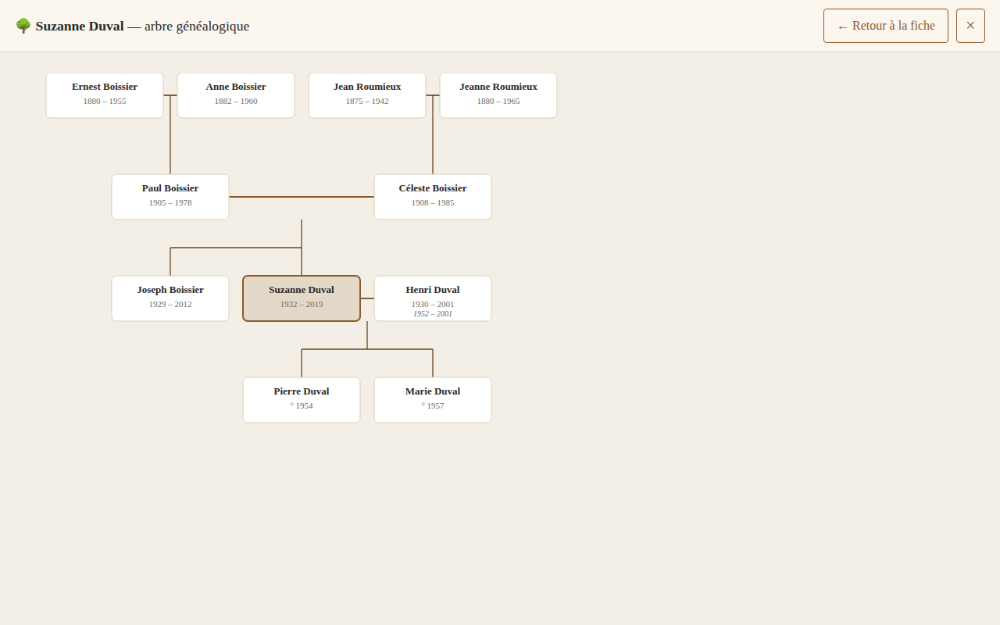
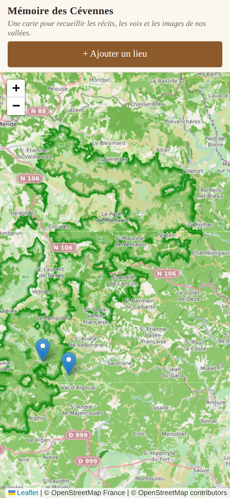
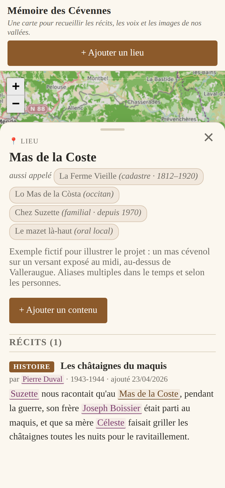
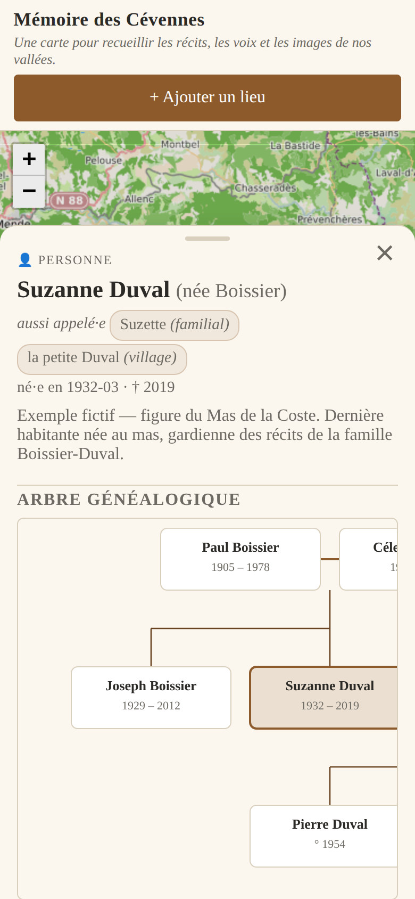

# Mémoire des Cévennes

Carte interactive pour **préserver la mémoire vivante des Cévennes** : photos,
témoignages (écrits et audio), récits, dessins et notes attachés à des lieux
précis de la carte, **tissés entre eux** par les personnes et les lieux qu'ils
évoquent.

Le projet a pour but de **recueillir la parole des anciens** autant que les
histoires contemporaines, et de les rattacher géographiquement à la vallée, au
hameau, au mazet ou au chemin où elles prennent sens.

## 👀 Aperçu en ligne

Preview du design, **lecture seule** (pas d'ajout, pas d'upload) :

👉 **<https://poisson48.github.io/Memoire_des_Cevennes/>**

La version complète (création de lieux, upload de photos/audio/vidéo…) tourne
sur serveur Node — voir *Démarrer en local* plus bas.

---

## 📸 Aperçu

### La carte



### Panneau d'un lieu — avec ses alias historiques et locaux

Chaque lieu peut porter plusieurs noms à la fois : une dénomination cadastrale,
une forme en occitan, un surnom familial, un surnom oral local. On voit ci-dessous
le **Mas de la Coste** (exemple fictif) et ses quatre façons d'être appelé.



### Panneau d'une personne + arbre généalogique

Clic sur le nom d'une personne mentionnée dans un récit → sa fiche s'ouvre
avec un **mini-arbre généalogique**, ses aliases, ses dates, et les récits
où elle contribue ou est mentionnée.



### Arbre généalogique en grand

Trois générations visibles, navigation par clic sur n'importe quelle carte
pour re-centrer. Les lignes de mariage (en orangé) distinguent les couples
des liens parent-enfant.



### Sur mobile

Le panneau devient un bottom sheet qui remonte depuis le bas, les dialogs
passent en plein écran, les boutons font ≥ 44 px pour les doigts.

| Carte | Lieu | Personne |
|:-:|:-:|:-:|
|  |  |  |

---

## 🧭 Ce que fait l'application (v0.2)

- **Carte Leaflet** des Cévennes (tuiles OpenStreetMap France).
- **Lieux** avec alias datés, contextuels (cadastre, occitan, familial…) et
  attachables à un locuteur précis (ex. *« Chez Suzette » — utilisé par
  Pierre Duval depuis 1970*).
- **Personnes** comme entités de premier rang, avec alias, bio, relations
  familiales (parents, conjoints, enfants dérivés).
- **Récits** ancrés sur un lieu, avec mentions de personnes et d'autres
  lieux rendues comme liens cliquables dans le corps du texte.
- **Navigation hypertexte** : cliquer un nom dans un récit → ouvre la fiche,
  boutons ← → du navigateur fonctionnent.
- **Arbre généalogique** SVG centré sur une personne, 3 générations par
  défaut, cliquer pour re-centrer.
- **Modération** : toute soumission atterrit en file `pending`, approuvée
  ou refusée par les admins via API protégée par token.
- **Mobile-friendly** : responsive complet.
- **Preview GitHub Pages** : déploiement automatique à chaque push.

---

## 🗂 Modèle de données

Trois entités (`places`, `people`, `stories`), trois fichiers JSON dans
`data/`, connectées en graphe :

```
Personne ──── parent/enfant ────▶ Personne
Personne ──── conjoint ─────────▶ Personne
Récit    ──── ancré sur ────────▶ Lieu
Récit    ──── mentionne ────────▶ Personne / Lieu (avec offsets start/end)
Personne ──── contributeur de ──▶ Récit
```

Chaque lieu et chaque personne peut avoir plusieurs **alias** :
- **temporels** (startYear / endYear — utile pour les noms de lieux qui
  évoluent au fil des siècles),
- **sociaux** (`usedBy: personId` — pour distinguer « chez Suzette »
  quand c'est Pierre qui parle),
- **contextuels** (cadastre, occitan, oral local, familial…).

---

## Démarrer en local

Prérequis : Node 18+, git, un navigateur.

```bash
./run.sh            # lance le serveur sur le port 3003
PORT=3005 ./run.sh  # port personnalisé
./run.sh --no-pull  # skip git pull
./run.sh --no-open  # ne lance pas le navigateur
```

Ou à la main :

```bash
npm install
ADMIN_TOKEN=un-token npm start     # node server.js
```

Puis ouvre <http://localhost:3003>.

### Modération (admin)

Toutes les soumissions tombent en `pending`. Pour voir / approuver :

```bash
# File d'attente
curl http://localhost:3003/api/admin/queue -H "X-Admin-Token: $ADMIN_TOKEN"

# Approuver
curl -X POST http://localhost:3003/api/admin/places/<id>/approve \
  -H "X-Admin-Token: $ADMIN_TOKEN" -H "Content-Type: application/json" \
  -d '{"reviewer":"moi"}'

# Refuser avec motif
curl -X POST http://localhost:3003/api/admin/stories/<id>/reject \
  -H "X-Admin-Token: $ADMIN_TOKEN" -H "Content-Type: application/json" \
  -d '{"reviewer":"moi","reason":"contenu hors sujet"}'
```

Interface graphique `/admin` : à venir (ticket 7).

### Re-générer les captures d'écran

```bash
PORT=3109 node server.js &         # lance le serveur
PORT=3109 node scripts/screenshots.js   # génère docs/screenshots/
```

---

## Arborescence

```
memoire_des_cevennes/
├── server.js               # Express + Multer + routes admin
├── package.json
├── run.sh                  # pull + install + start + open
├── data/
│   ├── places.json         # lieux + aliases
│   ├── people.json         # personnes + relations familiales
│   └── stories.json        # récits + mentions (offsets)
├── uploads/                # médias binaires (NON versionnés — voir plus bas)
├── public/                 # frontend vanilla
│   ├── index.html
│   ├── css/style.css
│   └── js/
│       ├── app.js          # carte, panneaux, routage
│       └── tree.js         # arbre généalogique SVG
├── src/
│   ├── storage.js          # I/O des 3 fichiers avec verrou
│   ├── schema.js           # normalisation + validation des entités
│   ├── places.js           # CRUD Lieux
│   ├── people.js           # CRUD Personnes (+ dérivation enfants/fratrie)
│   ├── stories.js          # CRUD Récits (+ filtres par lieu/personne)
│   ├── resolve.js          # résolution d'alias (recherche)
│   └── moderation.js       # file d'attente + approve/reject
├── scripts/
│   └── screenshots.js      # playwright → docs/screenshots/
├── docs/
│   └── screenshots/        # images du README
└── tests/                  # playwright E2E (à venir)
```

## Stockage

- **`data/*.json`** — structure du graphe (lieux, personnes, récits,
  mentions). Versionné dans git, on suit l'évolution dans l'historique.
- **`uploads/`** — fichiers binaires (photos, audio, vidéo, PDF). **Ignorés
  par git** : ils peuvent être gros (audio long, vidéo), pèsent sur le repo,
  et sortent du périmètre "Preview statique". Stratégies suivant :
  - sauvegarde `rsync` ou disque externe,
  - Git LFS si on veut les versionner,
  - ou un bucket externe (S3 / Backblaze / OVH) avec URL publique.

## Licence

À définir — probablement **CC-BY-SA** pour les contenus et **MIT** pour le code.

---

*Un petit outil pour que les pierres des Cévennes continuent de raconter
leur monde.*
